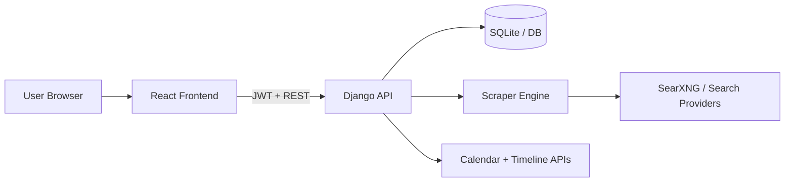

# Streak Maintainer


A full-stack productivity and career command center for students.

Streak Maintainer combines:
- Daily streak and habit tracking
- Coding profile and contest monitoring
- Hiring and internship opportunity tracking
- Interview prep workflows

Built with a React frontend and a Django REST backend.

---

## Demo

Add screenshots or GIFs in a `docs/` folder and update these links:

- Dashboard screenshot: `docs/dashboard.png`
- Hiring tracker screenshot: `docs/hiring-tracker.png`
- Scrape progress GIF: `docs/scrape-progress.gif`

Example markdown:

```md


```

---

## Why This Project Is Useful

Most students use 5-10 different tools to track:
- Daily consistency
- Placement prep
- Internships/jobs
- Interview readiness

This project brings everything into one dashboard and adds automation via scrapers and API-driven updates.

---

## Core Features

### Productivity + Streaks
- Daily logs (today + history)
- Goals and tasks
- Quotes and planning workflow

### Coding + Contest Tracking
- Coding profile stats
- Contest feed endpoints

### Hiring Tracker
- Opportunity dashboard buckets (apply now, coming soon, prepare now, long term, missed)
- Timeline and analytics views
- Calendar event feed
- Automated scraper pipeline with dedup

### Interview Prep
- Interview prep module in backend app `interview_prep`

---

## Architecture



---

## Tech Stack

### Frontend
- React
- Axios
- React Router

### Backend
- Django
- Django REST Framework
- JWT auth (SimpleJWT)
- SQLite (default, configurable)
- Celery + Redis (optional/background workflows)

---

## Repository Structure

```text
.
|-- frontend/                 # React app
|-- backend/                  # Django project (config, apps, APIs)
|-- Offcampus Integration/    # Additional integration modules
|-- manage.py                 # Root helper (do not use for backend runserver)
|-- requirements.txt
```

Important: the active Django project settings module is inside `backend/config`.
Run backend commands from `backend/` directory to avoid import errors.

---

## Feature Walkthrough

1. Sign in and create your daily log/tasks.
2. Track coding profile and contest windows.
3. Open Hiring Tracker to view opportunities by urgency bucket.
4. Trigger scraper sync and watch source-by-source progress.
5. Use timeline + analytics to plan preparation windows.

---

## Quick Start

### 1) Clone

```bash
git clone <your-repo-url>
cd Streak_Maintainer-main
```

### 2) Backend Setup

```bash
cd backend
python -m venv ../venv
../venv/Scripts/activate
pip install -r ../requirements.txt
```

Create `.env` in project root or in `backend/` with at least:

```env
SECRET_KEY=replace-with-your-secret
DEBUG=True
```

Run migrations:

```bash
python manage.py migrate
```

Start backend:

```bash
python manage.py runserver
```

API base URL: `http://127.0.0.1:8000/api`

### 3) Frontend Setup

Open a second terminal:

```bash
cd frontend
npm install
npm start
```

Frontend app: `http://localhost:3000`

---

## Environment Variables

Minimum:

```env
SECRET_KEY=replace-with-your-secret
DEBUG=True
```

Optional scraper settings:

```env
SEARXNG_BASE_URLS=https://searx.be,https://search.sapti.me
ALLOW_DDG_FALLBACK=false
SEARCH_PROVIDER_ORDER=searxng,ddg
```

---

## Auth Endpoints

- `POST /api/auth/register/`
- `POST /api/auth/login/`
- `POST /api/auth/refresh/`

---

## Hiring API Endpoints

- `GET /api/hiring/dashboard/`
- `GET /api/hiring/analytics/`
- `GET /api/hiring/timeline/`
- `POST /api/hiring/scrape/`
- `GET /api/hiring/calendar/events/`
- `GET /api/hiring/calendar.ics`

CRUD endpoints:
- `/api/hiring/opportunities/`
- `/api/hiring/companies/`
- `/api/hiring/seasons/`

---

## Scraper Configuration (Free)

Search-backed sources are configured to use free SearXNG instances by default.

Optional environment variables:

```env
# Comma-separated SearXNG instances
SEARXNG_BASE_URLS=https://searx.be,https://search.sapti.me

# Optional fallback to DDG wrapper (disabled by default)
ALLOW_DDG_FALLBACK=false

# Optional provider order
SEARCH_PROVIDER_ORDER=searxng,ddg
```

Notes:
- Free public instances can be unstable/rate-limited.
- You can host your own SearXNG instance for more reliability.

---

## Troubleshooting

### Error: `No module named 'config'`
Cause: running `manage.py runserver` from repo root.

Fix:

```bash
cd backend
python manage.py runserver
```

### Frontend says backend is unreachable
- Ensure backend is running at `127.0.0.1:8000`
- Verify `REACT_APP_API_URL` if using a custom backend URL

### Scraping runs but returns few/no results
- Check SearXNG instance health
- Try custom `SEARXNG_BASE_URLS`
- Enable DDG fallback only if needed

---

## Scripts

### Frontend

```bash
npm start
npm run build
npm test
```

### Backend

```bash
python manage.py check
python manage.py migrate
python manage.py runserver
```

---

## Roadmap

- Add async scrape jobs with background workers
- Add per-source live progress endpoint
- Improve source-specific normalizers for better precision
- Add notifications for new opportunities

---

## Contributing

1. Fork the repo
2. Create a branch
3. Commit focused changes
4. Open a pull request

---

## License

Add your preferred license (MIT/Apache-2.0/etc.) in a `LICENSE` file.

---

If you like this project, give it a star on GitHub and share it with friends preparing for internships and placements.
